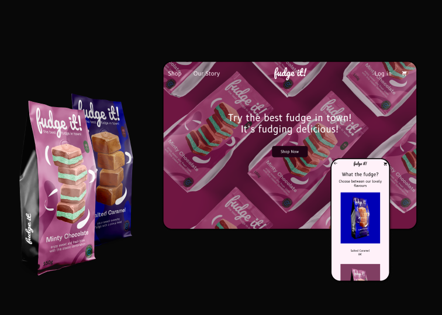

<article>

    <h1>Fudge UI Design</h1>

    <figure>
        
    </figure>

    <h2>The Challenge</h2>
    
The challenge was to create an online store that sold a product, with both mobile and desktop versions. 
        Both versions had to follow a design system with only one typeface and three main colors. 
        Throughout the product materialization process, the design system suffered consecutive changes until it gained its visual expression that reflected the brand's personality..
 
    
    <h2>Why Fudge?</h2>
    
I chose fudge as my product, mostly for the doors that opened me in terms of copyright. I wanted to do something that could have a relaxed and fun side (and if I could even plug some puns the better). I was inspired by funky flavor combinations that appealed to a more young adventurous target. Embracing, at the same time, core values which I think are very important like fair trade and local and sustainable production..

    
<a href="https://www.behance.net/gallery/118040139/Fudge-it-UI-Design" target="_blank" title="Go to Behance">Click here</a>for the full case study

        
    <figure>
        
    </figure>

  
</article>

